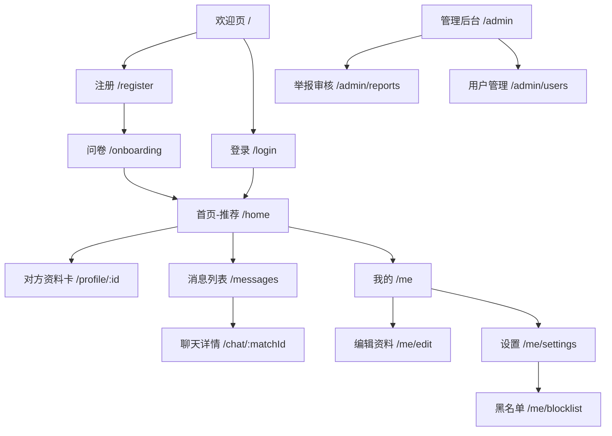

# SWU Date — 校园匹配社交网站 实施方案 (已确认版)

## 一、已确认决策

| 问题 | 决策 |
|------|------|
| 后端选型 | **后端不限，优先便宜或免费**；MVP 默认采用 **Supabase 免费层**，后续可按需要迁移到 Cloudflare Workers + D1 |
| 登录方式 | **学号登录** (学号作为唯一标识)；首版先做学号 + 密码，后续再加 2~3 个简单验证问题 |
| 部署平台 | **Cloudflare Pages** + Git 推送部署 (已有经验，电脑已安装 Git) |
| 项目路径 | `e:\Finance-code\swu-date\` |
| 问卷题量 | **控制在 15~20 题**，默认推荐 18 题，分模块组织 |
| 管理后台 | **需要**，举报审核 + 用户管理 |

---

## 二、产品定位

| 维度 | 定义 |
|------|------|
| **一句话** | 面向西南大学在校生的低门槛匹配交友网站 |
| **核心机制** | 学号注册 → 画像问卷(建议 18 题，控制在 15~20 题) → 规则匹配推荐 → 双向同意后交流 |
| **设计原则** | 低压力、隐私保护、安全感优先 |
| **技术约束** | 单人开发 (vibecoding)，优先便宜/免费方案，后端保持可替换，尽量减少运维 |

---

## 三、技术选型

| 层 | 选型 | 理由 |
|----|------|------|
| **前端框架** | Vite + React 18 + TypeScript | 开发速度快，生态成熟 |
| **样式** | 原生 CSS + CSS Variables | 不引入额外依赖 |
| **路由** | React Router v6 | SPA 足够 |
| **状态管理** | Zustand | 极简，适合单人项目 |
| **后端 (MVP 默认)** | Supabase (免费层) | Auth + DB + Realtime + Storage 一站式，成本低、最快上线 |
| **后端备选** | Cloudflare Workers + D1 / Firebase | 如果后续更希望统一到 Cloudflare 生态或沿用现成账号资源，可迁移 |
| **实时聊天** | Supabase Realtime (当前默认) | 无需自建 WebSocket，MVP 成本最低 |
| **部署** | Cloudflare Pages | 已有经验，电脑已安装 Git，可直接 Git 推送自动部署 |
| **图标** | Lucide Icons | 轻量一致 |

---

> 选型说明：后端不设死。为了符合“尽量便宜或免费”和“单人快速上线”，当前文档默认以 Supabase 免费层作为 MVP 实现；如果后续更想统一在 Cloudflare 生态，再把服务层迁移到 Workers + D1。

## 四、核心数据模型

### 4.1 用户表 (users)

```
users
├── id: uuid (PK, 关联 auth.users)
├── student_id: string (学号，唯一)
├── nickname: string (昵称，2~12字)
├── avatar_url: string | null
├── gender: enum('male','female','other','prefer_not_say')
├── grade: string (年级)
├── college: string (学院)
├── bio: string (一句话简介, ≤100字)
├── role: enum('user','admin') (用户角色)
├── is_banned: boolean (是否被封禁)
├── created_at: timestamp
├── is_verified: boolean (是否通过验证问题)
└── last_active_at: timestamp
```

### 4.2 画像问卷 (profile_answers)

```
profile_answers
├── id: uuid (PK)
├── user_id: uuid (FK → users)
├── question_id: string
├── answer: jsonb (支持字符串/数组)
└── updated_at: timestamp
```

### 4.3 问卷题目设计 (默认 18 题，可在 15~20 题内微调，分 4 个模块)

#### 模块一：基本信息 (3 题)
| # | 问题 | 类型 |
|---|------|------|
| 1 | 你的年级？ | 单选: 大一/大二/大三/大四/研一/研二/研三/博士 |
| 2 | 你的学院？ | 下拉选择 (西南大学所有学院) |
| 3 | 你的 MBTI？(选填) | 单选: 16种 + "不知道" |

#### 模块二：性格与生活方式 (6 题)
| # | 问题 | 类型 |
|---|------|------|
| 4 | 周末更喜欢？ | 单选: 宅家充电 / 出门探索 / 看心情 |
| 5 | 你的作息习惯？ | 单选: 早睡早起 / 夜猫子 / 随缘 |
| 6 | 你更偏向？ | 单选: I人(内向) / E人(外向) / 看场合 |
| 7 | 你的运动频率？ | 单选: 每天都动 / 偶尔 / 能躺绝不站 |
| 8 | 你喜欢的放松方式？ | 多选(≤3): 刷剧 / 游戏 / 读书 / 音乐 / 运动 / 逛街 / 摄影 / 做饭 |
| 9 | 你对养宠物的态度？ | 单选: 超爱 / 无感 / 有点怕 |

#### 模块三：价值观与恋爱观 (5 题)
| # | 问题 | 类型 |
|---|------|------|
| 10 | 恋爱中最看重什么？ | 多选(≤3): 颜值 / 三观一致 / 幽默感 / 上进心 / 陪伴感 / 安全感 / 独立性 / 浪漫 |
| 11 | 你觉得理想的恋爱节奏是？ | 单选: 慢慢来 / 确认心意就在一起 / 顺其自然 |
| 12 | 能接受异地吗？ | 单选: 完全OK / 不太行 / 看缘分 |
| 13 | 对未来的规划态度？ | 单选: 有明确计划 / 走一步看一步 / 计划赶不上变化 |
| 14 | 你更希望另一半？ | 单选: 和我互补 / 和我相似 / 无所谓 |

#### 模块四：偏好与表达 (4 题)
| # | 问题 | 类型 |
|---|------|------|
| 15 | 理想的约会方式？ | 多选(≤2): 咖啡聊天 / 户外运动 / 看展 / 逛街吃美食 / 宅家煲剧 / 密室剧本杀 |
| 16 | 你在吃的方面？ | 单选: 啥都吃 / 偏辣 / 偏清淡 / 素食 |
| 17 | 用一个 emoji 形容自己 | 文本(1字符) |
| 18 | 想对未来的 ta 说一句话 | 文本(≤50字) |

### 4.4 匹配与互动

```
interactions (互动记录)
├── id: uuid (PK)
├── user_id: uuid (FK)
├── target_id: uuid (FK)
├── action: enum('like','skip')
├── created_at: timestamp
└── UNIQUE(user_id, target_id)

matches (匹配记录)
├── id: uuid (PK)
├── user_a: uuid (FK)
├── user_b: uuid (FK)
├── score: integer (匹配分 0~100)
├── status: enum('matched','unmatched')
├── created_at: timestamp
└── matched_at: timestamp

messages (消息)
├── id: uuid (PK)
├── match_id: uuid (FK → matches)
├── sender_id: uuid (FK → users)
├── content: text (≤500字)
├── created_at: timestamp
└── is_read: boolean

reports (举报)
├── id: uuid (PK)
├── reporter_id: uuid (FK)
├── reported_id: uuid (FK)
├── reason: enum('harassment','fake','spam','nsfw','other')
├── detail: text (≤200字)
├── status: enum('pending','resolved','dismissed')
├── admin_note: text | null
├── created_at: timestamp
└── resolved_at: timestamp | null

blocklist (黑名单)
├── id: uuid (PK)
├── blocker_id: uuid (FK)
├── blocked_id: uuid (FK)
├── created_at: timestamp
└── UNIQUE(blocker_id, blocked_id)
```

---

## 五、页面结构



| 页面 | 路由 | 说明 |
|------|------|------|
| 欢迎页 | `/` | 品牌展示 + 登录/注册入口 |
| 注册 | `/register` | 学号 + 密码 + 昵称 + 性别 |
| 登录 | `/login` | 学号 + 密码 |
| 问卷 | `/onboarding` | 15~20 题画像问卷 (当前默认 18 题) |
| 首页-推荐 | `/home` | 每日推荐卡片 ❤️ / ✕ |
| 资料卡 | `/profile/:id` | 对方公开信息 |
| 消息列表 | `/messages` | 已匹配用户聊天入口 |
| 聊天详情 | `/chat/:matchId` | 实时文本聊天 |
| 我的 | `/me` | 个人信息预览 |
| 编辑资料 | `/me/edit` | 修改昵称/头像/问卷 |
| 设置 | `/me/settings` | 账号安全、注销、隐私 |
| 黑名单 | `/me/blocklist` | 已屏蔽用户 |
| 管理后台 | `/admin` | 管理员仪表盘 |
| 举报审核 | `/admin/reports` | 查看/处理举报 |
| 用户管理 | `/admin/users` | 查看/封禁用户 |

---

## 六、匹配算法

| 维度 | 分值 | 逻辑 |
|------|------|------|
| 同学院 | +5 | 精确匹配 |
| 同年级 | +5 | 精确匹配 |
| MBTI 兼容 | +8 | 基于兼容矩阵 |
| 生活方式重叠 (6 题) | 每题 +5，满 30 | 选项相同得分 |
| 价值观重叠 (5 题) | 每题 +5，满 25 | 选项相同/交集得分 |
| 约会方式重叠 | +7 | Jaccard 系数 × 7 |
| 饮食习惯兼容 | +5 | 相同 +5 / 相近 +3 |
| 互补/相似偏好 | +5 | 题14答案对照 |
| 随机扰动 | ±10 | 避免千篇一律 |

**每日推荐 3~5 人**

---

## 七、安全与隐私

| 措施 | 说明 |
|------|------|
| 学号认证 | V1 先做学号 + 密码；V1.1 再补 2~3 个简单验证问题 |
| 双向同意 | 双方 ❤️ 后才能聊天 |
| 举报系统 | 举报 → 管理后台审核 |
| 黑名单 | 屏蔽后互不可见 |
| 敏感词过滤 | 聊天消息过滤脏话/广告/诈骗 |
| 信息最小化 | 资料卡不暴露学号、手机号 |
| 注销权 | 一键注销删除所有数据 |
| 冷却机制 | 每日推荐有限 |
| 免责声明 | 首次使用前确认 |

---

## 八、管理后台设计

### 管理员权限
- users 表 `role` 字段区分 user/admin
- 路由守卫: 仅 admin 可访问 /admin/*
- 初始管理员通过 Supabase 后台手动设置

### 举报审核页
- 举报列表 (时间倒序): 举报人/被举报人/原因/时间/状态
- 筛选: 全部 / 待处理 / 已处理
- 操作: 警告用户 / 封禁用户 / 驳回举报
- 查看聊天记录上下文

### 用户管理页
- 用户列表: 搜索/筛选 (学号/昵称/学院/状态)
- 操作: 封禁/解封

---

## 九、部署流程

```
本地开发 → Git commit / push → Cloudflare Pages 自动构建
```

- 本地开发使用 Git 管理；电脑已安装 Git，可直接接入远程仓库
- 构建命令: `npm run build`
- 输出目录: `dist`
- 环境变量: `VITE_SUPABASE_URL` + `VITE_SUPABASE_ANON_KEY`

---

## 十、执行路线图

| Phase | 内容 | 预估时间 |
|-------|------|----------|
| 0 | 初始化 + 设计系统 + DB | 2~3h |
| 1 | 学号注册/登录 + Auth | 3~4h |
| 2 | 15~20 题问卷系统 (默认 18 题) | 3~4h |
| 3 | 匹配算法引擎 | 3~4h |
| 4 | 推荐首页 + 弹窗 | 3~4h |
| 5 | 聊天系统 | 4~5h |
| 6 | 安全风控 | 3~4h |
| 7 | 个人中心 | 2~3h |
| 8 | 管理后台 | 3~4h |
| 9 | 打磨部署 | 3~4h |
| **合计** | | **vibecoding ~12~20h** |

